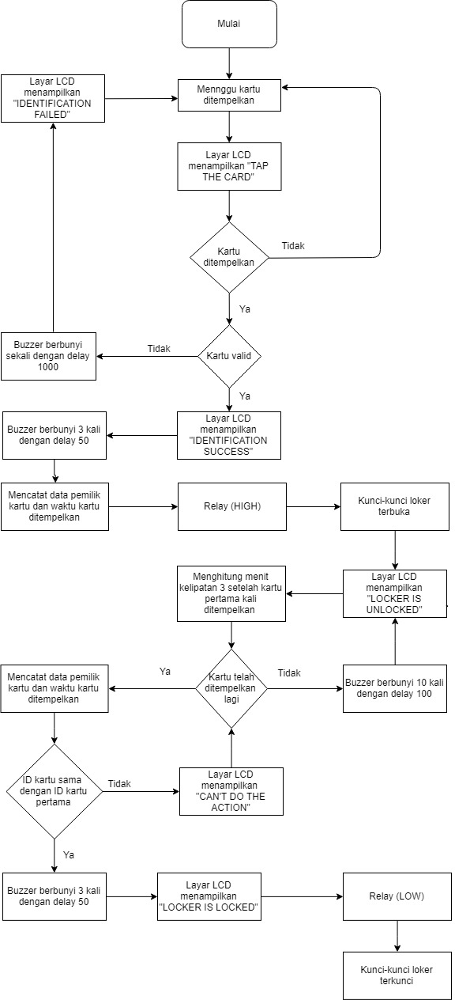

Loker AMV

Flowchart

TODO LIST
1. bikin array buat namanya biar lcd bisa ngeprint nama pemilik kartu

2. tes kodingan, terutama rtc sama sd card adapter, jika gabisa ada beberapa opsi
	- set cs low ketika mau dipake dan di high lagi ketika selesai
	- tambah diode di miso sd card adapter
	- tambah resistor 330 di miso sd card adapter
	- tambah tri state buffer di miso sdcard adapter
